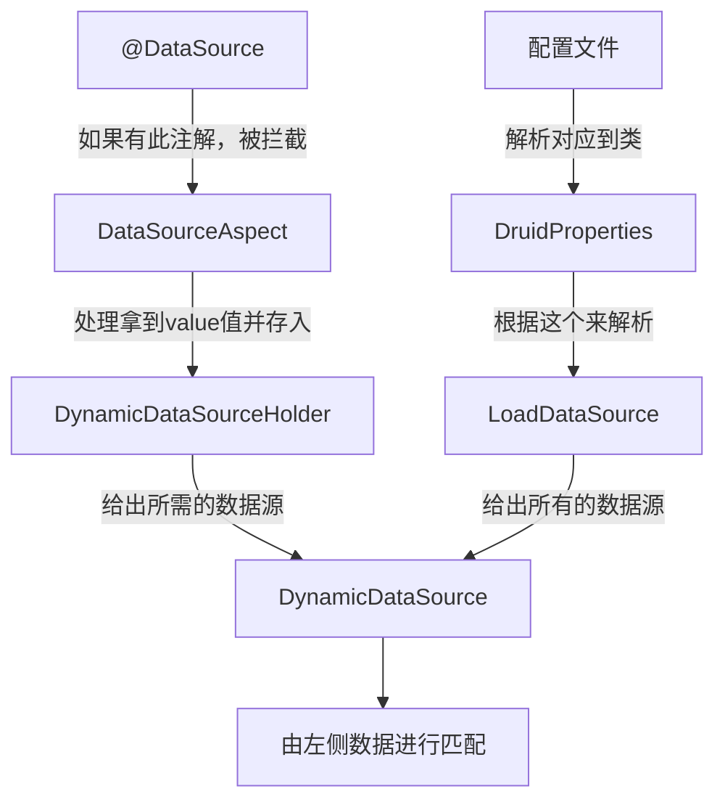

RuoYi 的多数据源只能有两个，此demo可以配置更多的数据源

1. 配置多个数据源：此处用test1、test2
2. 把其余配置放在datasource下，而不是datasource.ds下。（因为DruidProperties匹配的是datasource下的配置）

另：有切面的注释

```mermaid
flowchart TD
A["@DataSource"] --"如果有此注解，被拦截"--> B 
B["DataSourceAspect"] --"处理拿到value值并存入"--> E --给出所需的数据源--> D
配置文件 --解析对应到类--> C["DruidProperties"] --根据这个来解析-->F --给出所有的数据源-->D-->由左侧数据进行匹配
D["DynamicDataSource"]
E["DynamicDataSourceHolder"]
F["LoadDataSource"]
```
