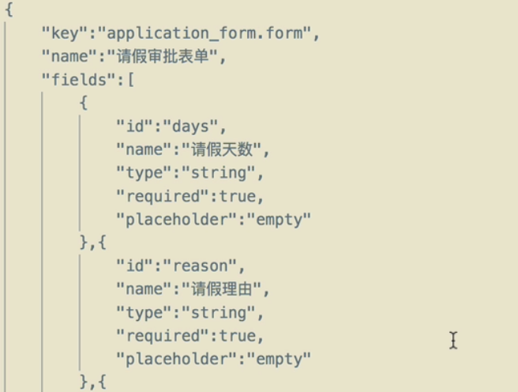

**笔记有点乱**

# 部署

## /resources/processes文件夹下的所有流程文件默认会被自动部署
### 跟流程部署相关的表以 `ACT_RE_` 为前缀

`ACT_RE_DEPLOYMENT` `ACT_RE_PROCDEF` 分别保存了流程定义的相关信息  
`ACT_GE_BYTEARRAY` 保存了流程的 **xml文件**以及**根据xml文件生成的流程图**
### 流程部署后可以直接在xml中修改，重启后会自动更新
    数据库新添加记录，且version会自增1.
1. xml文件中的`targetNamespace`其实就是流程的分类定义（数据库PROCDEF中的category字段），如果想要修改流程定义的分类，直接修改它即可
## 自动部署的自定义配置
1. 项目启动时是否自动检查流程图文件。不检查即不会自动部署流程了
   flowable.check-process-definitions=true
2. 设置流程文件的位置
   flowable.process-definition-location-prefix=classpath*:/processes/
3. 指定流程文件的后缀 
   flowable.process-definition-location-suffixes=**.bpmn20.xml,**.bpmn
## 手动部署
项目启动成功后，再去部署流程。常用接口来部署.  
参见PROcessDeployController
# 查询
`RepositoryService repositoryService`

## 查询流程定义相关信息（_RE_PROCDEF）
`repositoryService.createProcessDefinitionQuery().list();` 查询流程
`repositoryService.createProcessDefinitionQuery().latestVersion().list();` 查询所有流程的最新版本
`repositoryService.createProcessDefinitionQuery().processDefinitionKey("submit_an_expense_account").list();`根据xml文件中的id查询（对应RE_PROCDEF中的KEY）
### 自定义查询流程定义信息(_RE_PROCDEF)
`repositoryService.createNativeProcessDefinitionQuery().sql("").parameter().list;` 自定义查询语句。
### 查询流程部署信息(_RE_deployment)
`repositoryService.createDeploymentQuery().list()`查询所有
`repositoryService.createDeploymentQuery().deploymentCategory("").list();` 根据分类查询
### 自定义查询部署信息（_RE_deployment）
`repositoryService.createNativeDeploymentQuery().sql("").parameter("","").list();`
`repositoryService.deleteDeployment(id);` 删除  
**以上都可以通过嵌套for循环拿到某些信息在此查询来实现更复杂的功能**  
# 流程运行

**流程运行中设计到的表都是以`ACT_RU_`前缀开头,且流程执行完毕后这些数据都会被清除**
`RuntimeService runtimeService;`
`runtimeService.startProcessInstanceByKey(processDefinitionKey)` key是xml中的id
注意：直接下载下来的文件有点小问题，变量需要变为 #{INITATOR} 
流程启动成功后，`ACT_RU_EXECUTION` 表中保存了所有流程执行的信息(包括启动节点和其他任务节点)  
同时，如果这个节点是UserTask，则这个节点的信息还会保存在`ACT_RU_TASK`中（该表用来保存userTask）  
还有`ACT_TU_ACTINST`表中还会保存流程的执行情况。

### 设置发起人的两种方式

1. `Authentication.setAuthenticatedUserId("wangwu");`
2. `identityService.setAuthenticatedUserId("wangwu");`
### 候选人/组

#### 定义候选人。

ui中直接设置或xml里的`candidateUsers=“zhangsan,lisi,wangwu”`。但查询不能再使用之前的方案（因为assignee为空）

#### 查询候选人的可认领任务

`taskService.createTaskQuery().taskCandidateUser("zhangsan").list();`候选人查询，**在某个组也算候选**

#### 通过组查询候选人任务

`taskService.createTaskQuery().taskCandidateGroup("manager").list()` 直接用组查询候选人（注意上面是User，这里是Group）

#### 通过变量指定候选组是哪个组（不在xml里写死）

与其他的类似，在ui里的候选组使用`${g}`。然后`map.put("g","manager")`。再`runtimeService.startProcessInstanceByKey("UserTaskDemo",map)`在启动时设置某活动的候选组是哪个组

#### 添加与删除候选人

### 根据流程ID查询流程参与者(候选人)

```java
ProcessInstance pi = runtimeService.createProcessInstanceQuery().singleResult();
List<IdentityLink> links =runtimeService.getIdentityLinksForProcessInstance(pi.getId());
for (IdentityLink link : links) {
    //各个参与人
}
```

### 任务处理

`taskService.createTaskQuery().taskAssignee("wangwu").list();`

`taskService.complete(task.getId());`

---

当只有候选人时，不能用complete。需要先**认领**（其实就是设置assignee，但不是setAssignee方法而是cliam方法）再处理。**需要注意的是如果Assignee有人了，则无法认领**

```java
List<Task> tasks = taskService.createTaskQuery().taskCandidateUser("zhangsan").list();
for (Task task : tasks) {
    taskService.claim(task.getId(),"zhangsan");
}
```

### 任务认领回退

已经认领的任务回退，让其他人认领。其实就是置为null

`taskService.setAssignee(task.getId(),null)`

### 判断是否结束
借助数据库的表数据来判断
### 删除流程实例(正在运行的不想要了)
`runtimeService.deleteProcessInstance("processInstanceId","the reason of delete");`
`runtimeService.createProcessInstanceQuery().processInstanceId(processId).singleResult();` ==null则运行完成
### 查看运行的活动节点(查看走到哪一步了)
```java
List<Execution> list = runtimeService.createExecutionQuery().list();
for (Execution execution : list) {
   List<String> activeActivityIds = runtimeService.getActiveActivityIds(execution.getId());
}//然后它就是执行到了哪一步（可能多条路线？）
```

# 挂起、恢复
## 流程定义
`repositoryService.isProcessDefinitionSuspended(pd.getId())` 判断是否挂起
`repositoryService.suspendProcessDefinitionById();` 挂起
`repositoryService.activateProcessDefinitionById();` 激活
**其实就是修改_RE_PROCDEF中的SUSPENSTION_STATE字段 1表示激活的，2表示挂起的**
## 流程实例
挂起和激活其实也是上面的函数，不过参数不同。（比如第二个参数是 “是否挂起对应的实例”， 第三个参数 是何时被挂起）
**涉及到 `_RU_EXECUTION` `_RU_TASK` `_RE_PROCDEF` 三张表**
# DataObject
数据对象（不选择任何节点）本质上是给流程设置一些全局属性。
流程启动后，这些属性（以及其他变量，如INTIATOR)会在`_RU_VARIABLE`中记录
## 使用
`runtimeService.getDataObject(execution.getId())`.得到一个map，用.keySet拿到键值后遍历各个变量。可以用getValue等取得实际变量值  
# 租户 Tenant
假如有4个子系统，它们都需要相同的流程。利用租户tenant进行区分
部署时 `repositoryService.tenantId("javaboy"")` 参见Controller中的部署代码。部署成功后可以在`_RE_PROCDEF`中看到`TENANT_ID`
一个流程在定义时如果指定了租户ID，那么在 **启动**时也必须指定租户ID。执行任务不需要指定  
`runtimeService.startProcessInstanceByKeyAndTenantId(processDefinitionKey,"javaboy");` 需要添加一个TenantID参数
虽然执行不需要指定租户，但是可以通过租户查询Task`taskService.createTaskQuery().taskTenantId("javaboy").list()`
# 流程任务
## ReceiveTask：人工trigger（ui里点左下角小扳手）

接收任务，一般不需要做什么（可能只是系统无法自动判断，需要借助人来判断）。但需要用户手动trigger一下（点一下）。
所以receiverTask就是让任务停一下，然后人工判断是否继续走。且并不指定具体的人。

## UserTask：最常见的

### 单个用户

1. 直接指定具体用户：固定中设置
2. 通过变量来设置：可以在**流程启动时通过变量可以指定处理人**
3. 通过监听器设置：可以在**特定时刻设置一个处理人**可选时刻如下

   
4. 设置为流程的发起人：

   

   设置的是一个变量，变量的名称就是`INITATOR`

   **其实就是流程启动中设置发起人的两种方式，以上是其中一种**

### 多个用户/候选用户

在候选里用变量即可，如：`${userIds}`。然后使用时`map.put("userIds","zhansan,lisi,wangwu")`作为`startProcessInstanceByKey`的第二个参数即可

如果使用监听器：则`delegateTask.addCandidateUser("zhangsan");`注意一次添加一个

## ServiceTask

系统自动完成的任务，流程走到这一步会自动执行。

### 监听类

1. 首先定义一个实现了JavaDelegate的监听器类MyServiceTask01

2. 在绘制流程图时为ServiceTask配置监听器类引用，如：com.example.flowableprocess.servicetask.MyServiceTask01

   

   流程已启动到达ServiceTask活动即可自动触发execute方法。且ServiceTask执行中不会保存到_RU_TASK中

#### 监听类里的变量/属性


```java
public class MyServiceTask01 implements JavaDelegate {
    Expression username;//注意是 flowable..delegate里的.
    //且特别注意： 变量名必须对应ui/xml里的名字。不能随便取
    @Override
    public void execute(DelegateExecution delegateExecution) {
  			System.out.println("===MyServiceTask01===getExpressionText"+username.getExpressionText());
    		System.out.println("===MyServiceTask01===getValue"+username.getValue(delegateExecution));//多传入一个上下文
    }
}
```

**特别注意的是：代码里的变量名必须和ui/xml文件中的'名称' 对应**

### 委托表达式

类似监听器类，但是可以将类注册到Spring容器中，然后给流程图配置的时候直接配置Bean名称即可（不再需要是完整引用了）

**其实就是类前加个注解 @Component**。然后在ui里的“委托表达式”（不再是‘类’了，且注意清空‘类’）


### 表达式

以上两种（完整引用和委托表达式）都**离不开JavaDelegate接口**。如果只是一个**普通的Bean其实也可以配置为ServiceTask的执行类**。


## ScriptTask

脚本任务ScriptTask和ServiceTask类似也是自动执行的，不同之处在于脚本任务的逻辑通过一些非Java的脚本语言来实现

### JavaScript


其中：execution.setVariable保存一个名为sum的流程变量

> 注意：不能使用let关键字，以及java17不再自带javascript的问题。会遇到`org.flowable.common.engine.api.FlowableException: Can't find scripting engine for 'JavaScript'`问题。原因如下For everyone that does not understand how to solve this and why the problem is there. **Starting from Java 15 the Javascript Nashorn engine has been removed from the JDK JEP 372: Remove the Nashorn JavaScript Engine 10.If you want to keep using Javascript you will need to manually add Maven Central Repository Search**
>
> 添加依赖可获得javascript支持
>
> ```xml
> <dependency>
>     <groupId>org.openjdk.nashorn</groupId>
>     <artifactId>nashorn-core</artifactId>
>     <version>15.4</version>
> </dependency>
> ```

由于流程直接执行完毕，可以到_HI_VARINST查看历史记录中的变量值。

### Groovy

Groovy是基于JVM的编程语言，写java也可以运行。添加依赖

```xml
<dependency>
  <groupId>org.codehaus.groovy</groupId>
  <artifactId>groovy-all</artifactId>
  <version>3.0.13</version>
</dependency>
```

### Juel

全称JavaUnifiedExpressionLanguage。${xx}其实就是juel。

`${myServiceTask03.hello()}`即脚本内容。可用Bean的方法，类似《表达式》。

# 网关

## 排他网关

最常见的一种，也叫互斥网关。可以有多个入口，但只有一个出口。


## 并行网关

**并行网关是成对出现的**（开始和结束、分散和汇集）。其他的主要是画图，没什么特别的。

## 包容网关

可以自动根据具体条件，**自动转为上面两种**（排他网关、并行网关）

# 流程变量

## 全局流程变量

### 启动时设置

其实就是启动时带上map参数，不需要提前在ui中定义/使用。前面用到好几次了。

+ 获取变量属性值。`runtimeService.getVariable(execution.getId(),"name")`

如果是`getVaribales()`时不需要后面的参数，会把参数都返回.

### 通过Task设置

```java
//先查询task
Task task = taskService.createTaskQuery().taskAssignee("javaboy").singleResult();
taskService.setVariable(task.getId(),"resulet","同意");//逐个设置
//或使用setVariables用map批量设置
```

其中：taskId用于查询Task对应的流程实例Id和执行实例Id，插入时会用到。

### 完成任务时设置

`taskService.complete(task.getId(),map)`直接在完成函数中加参数即可

### 直接通过流程执行实例来设置

流程变量实际上是和流程实例相关的，故而直接通过流程执行实例设置也可以。

`runtimeService.setVariable(execution.getId(),"name","javaboy")`

## 本地流程变量

全局变量和流程绑定。但是本地流程变量是和一个具体的Task绑定的，Task执行完毕，流程变量消失

+ `taskService.setVariableLoacl(task.getId,map)`。注意这里是Local。

本地流程变量在数据库中比全局变量多了一个**Task_Id字段**。

**需要注意，用`runtimeService.getVariable`是搜索不到的，使用`taskService`可以**。

当前任务**完成**之后，流程变量会被**删除**

+ 同理可以在完成任务时设置：`taskService.complete(task.getId(),map,true);`  *true表示是LoaclScope*

+ 为Execution设置（runtime可用）

  `runtimeServeice.setVariableLocal(task1.getExecutionId(),"name")`

  读取`runtimeServeice.getVariableLocal(task2.getExecutionId(),"name")`

  + task1和task2是两个不同的人，但同一个流程、属于同一个执行实例，所以设置后可以读取到。

## 临时流程变量

临时变量不会存入数据库。

### 流程启动时设置

`runtimeService.createProcessInstanceBuilder.transientVariable("day",10).transientVariable("name","javaboy")...processDefinitionKey("").start()`

+ 不能直接使用start了，需要借助Builder来创建。且可以连续创建多个，最后`processXxx.start`

### 流程完成时设置

`taskService.complete(task.getId(),null,transientVariablesMap);`

第二个参数是全局的，第三个是临时变量。

# 历史信息

## 历史流程

查询**已经完成的流程**的信息

`historyService.createHistoricProcessInstanceQuery().finished().list();`

查询还没完成的信息`.unfinished()`

其实也可以看 EndTime字段。空表示未执行完

## 历史任务

`historyService.createHistoricTaskInstanceQuery().taskAssignee("zhangsan").finished().list();`其实就是多个一个`.taskAssignee()`的筛选而已。

## 历史活动

```java
List<HistoricProcessInstance> processInstances = 		historyService.createHistoricProcessInstanceQuery().finished().list();
for (HistoricProcessInstance pi : processInstances) {
            List<HistoricActivityInstance> list = 	historyService.createHistoricActivityInstanceQuery().processInstanceId(pi.getId()).list();
```

## 历史变量

`historyService.createHistoricVariableInstanceQuery().processInstanceId(pi.getId()).list();`

## 历史日志

其实就是前面的四个东西

`historyService.createProcessInstanceHistoryLogQuery(pi.getId());` LogQuery。

## 历史权限

`historyService.getHistoricIdentityLinksForProcessInstance(pi.getId())` 查询一个流程的处理人

## 自定义SQL

`historyService.createNativeHistoricProcessInstanceQuery().sql("");`

`historyService.createNativeHistoricTaskInstanceQuery().sql("")`

## 日志级别

配置哪些历史信息存入到 ACT_HI_XXX表中，在配置文件中设置

`flowable.history-level=activity`

+ None：全都不存储
+ Activity：存储所有 **流程实例 、活动实例**
+ Audit（默认）：Activity基础上增加 **流程的历史详细信息**
+ Full：Activity基础上再存储**变量的变化信息**

# 定时

## 定时激活

### 流程定义

使用`.activateProcessDefinitionsOn`给流程定义设置一个激活时间。`ACT_RE_PROCDEF`表中`SUSPENSION_STATE`字段值为2表示挂起状态。在`ACT_RU_TIMER_JOB`表中保存了要执行的定时任务，`DUEDATE_`字段保存了定时任务执行的时间。执行后把字段值改为1表示可用

```java
DeploymentBuilder deploymentBuilder = repositoryService.createDeployment()
                .name("Javaboy的工作流")//指_DEPLOYMENT中的name属性
                .category("这是我的流程分类")//指_DEPLOYMENT中的category属性,不是xml里的那个
                .key("自定义工作流的key")//指_DEPLOYMENT中的key属性
                //.tenantId("tenantId1")
                //设置‘流程定义’激活的时间，到达这个时间之前它不可用。到达时间点后。可以启用 
                .activateProcessDefinitionsOn(new Date(System.currentTimeMillis()+120*1000))//2分钟后激活
                .addInputStream(file.getOriginalFilename(), file.getInputStream());//设置文件输入流 add可以有多种方式，此处用流
        Deployment deploy = deploymentBuilder.deploy();
```

## 定时挂起

它是把 **流程定义** 和 对应的 **流程实例** **全部挂起**

`repositoryService.suspendProcessDefinitionByKey("Demo01",true,new Date())`

#### 对应的：定时激活

`repositoryService.activeProcessDefinitionByKey("Demo01",true,new Date())`

## 定时任务执行过程

并不是从`_TIMER_JOB`中查找定时任务，而是去`_RU_JOB`中查找数据（找到了立马执行）。时间到了以后，数据从`_TIMER_JOB`移动到`_RU_JOB`中然后再执行（便于后悔）。

比如**定时任务**（挂起）后**反悔**，则可以将定时任务移动到`DeadLetterJob`表中，则定时任务不会再执行

`managementServie.moveJobToDeadLetterJob(jobId)`

任务再从`DeadLetterJob`中**移回去**(又反悔)（但不管时间到不到都会立刻执行）：`mangementService.moveDeadLetterJobtoExecutableJob(jobId,retires)`第二个参数是重试次数

假如设置定时挂起后想要立刻挂起（移动到`RU_JOB`表中即可) `managementServie.moveTimerToExecutableJob(jobId)`

# 流程表单

1. 动态表单：一般来说不需要完整的页面，单纯的表单属性
2. 外置表单：自己定义一个HTML或JSON，在项目中引用。一般来说流程中用到的表单基本上都是外置表单
3. 内置表单：在ui中使用的那种

无论哪种，都**只有**在**开始节点和任务节点**（不包括连线、网关等）才支持表单定义。

> 为什么需要表单？如果使用变量在流程中去传递数据，变量传送数据的特点是零存零取，但是表单可以零存整取（可以一个一个设置，一次全拿出来）

## 动态表单


### 开始节点表单

`formService.getStartFormData(processDefintion.getId());`获得流程定义开始节点的表单

### 启动带表单的实例（开始节点有表单的情况）

用`formService.submitStartFormData(pd.getId(),vars)` 推荐此方式

也可以用`runtimeService.startProcessInstanceByKey("Demo01",vars);`但是这种方式**不会检查**各个表单属性是否正确（包括必须项是否填写，数据类型等）

### 查询任务上的表单

`formService.getTaskFormData(task.getId());`

### 保存和完成

### 保存

不会提交，其实就是修改某个表单数据

`formService.saveFormData(task.getId(),vars);` 需要注意，vars必须是全部的表单（即required的都得有，不是required的不管是不是修改都不必须）

### 完成

`formService.submitTaskFormData(task.getId(),vars);` 推荐，因为会校验数据。但日期格式暂不会校验

`taskService.complete()` 但它不会进行表单数据的校验，只是当作变量

## 外置表单

提前准备一个Html文件，作为外置表单。askLeave.html 如下所示。在开始节点的`表单标识`中填入

```html
<form action="">
    <table>
        <tr>
            <td>请假天数:</td>
            <td><input type="text" name="days" ></td>
        </tr>
        <tr>
            <td>请假理由:</td>
            <td><input type="text" name="reason"></td>
        </tr>
        <tr>
            <td>起始时间:</td>
            <td><input type="date" name="startTime"></td>
        </tr>
        <tr>
            <td>结束实践</td>
            <td><input type="date" name="endTime"></td>
        </tr> 
    </table>
</form>
```

+ 需要注意的是，此种方式在部署时需要同表单一起部署（Form表单需要跟流程具有相同的部署ID） 否则会在运行的时候查询不到表单。新写一个部署方法并部署。可以看到他们的ID是一样的

### 查看启动流程上的表单

```java
ProcessDefinition pd = repositoryService.createProcessDefinitionQuery().processDefinitionKey("ExtFormDemo01").latestVersion().singleResult();
        String startFormKey = formService.getStartFormKey(pd.getId());//获取启动节上外置表单的key
        logger.info("startFormKey is :",startFormKey);
        //查询启动节点上，渲染之后的流程表单（主要针对外置表单，动态表单没用）
        String renderedStartForm = (String) formService.getRenderedStartForm(pd.getId());
        logger.info(renderedStartForm);
```

+ 用法：如果是web项目，可以用ajax获得这个结果集，这个结果集就是一个已经渲染过的html。拿到html后就可以放到一个div中在前端渲染出来

  原html如下所示：

  ```html
  <form action="">
      <table>
          <tr>
              <td>请假天数:</td>
              <td><input type="text" name="days" value="${days}" ></td>
          </tr>
        	略
  ```

  从task中获得的是渲染后的html。（已经填入了值，比如${days}变成了10）

  ```html
  <table>
          <tr>
              <td>请假天数:</td>
              <td><input type="text" name="days" value="10" ></td>
          </tr>
    			略
  ```

  ## Json表单
  
  `flowable.form.resource-location=classpath*:/forms/` Json表单的默认位置
  
  `flowable.form.resource-suffixes=**.form`默认后缀是：`.form`
  
  但.form也是Java-Swing配置的默认后缀，在IDEA中，会被当成swing的配置打开。我们需要在一个外部编辑器中编辑好这个.form文件（不然就是IDEA自动判定为swing中的那种格式并配置）。form文件格式如下所示（不用IDEA编辑）
  
  
  
  + 其中key是唯一的（多个表单时），用于`表单的标识`

# 绘制

## 根据流程定义绘制流程图

```java
ProcessDefinition processDefinition = repositoryService.createProcessDefinitionQuery().processDefinitionKey("").latestVersion().singleResult();
        BpmnModel bpmnModel = repositoryService.getBpmnModel(processDefinition.getId());
        DefaultProcessDiagramGenerator generator = new DefaultProcessDiagramGenerator();
        InputStream stream = generator.generatePngDiagram(bpmnModel, 1.0, true);//流程图对象、缩放因子、是否绘制连接线上的文本
        FileUtils.copyInputStreamToFile(stream,new File("/path/pngname.png"));
        stream.close();
```

## 绘制当前流程进度

 ```java
 void test02(){
         ProcessDefinition processDefinition = repositoryService.createProcessDefinitionQuery().processDefinitionKey("").latestVersion().singleResult();
         //注意此处最好判断是不是空，空就不需要生成直接返回即可
         BpmnModel bpmnModel = repositoryService.getBpmnModel(processDefinition.getId());
         DefaultProcessDiagramGenerator generator = new DefaultProcessDiagramGenerator();
         //以上内容同绘制，进度的区别在下面.
         //查询当前流程下所有的活动信息（已经经过的活动会记录在数据库中，被用于判断并绘制）
         List<String> highLightedActivities=new ArrayList<>();
         List<String> highLightedFlows=new ArrayList<>();
         List<ActivityInstance> list = runtimeService.createActivityInstanceQuery().processInstanceId(processDefinition.getId()).list();
         for (ActivityInstance activityInstance : list) {
             //拿到每个，判断各种类型并处理
             if(activityInstance.getActivityType().equals("sequenceFlow")){
                 highLightedFlows.add(activityInstance.getActivityId());
             }else{
                 highLightedActivities.add(activityInstance.getActivityId());
             }
         }
         double scaleFactor=1.0;
         boolean drawSequeneFlowNameWithNoLabelDI=true;//以上是各种参数配置
         generator.generateDiagram(bpmnModel,"PNG",highLightedActivities,highLightedFlows,scaleFactor,drawSequeneFlowNameWithNoLabelDI);
     }
 ```

## 绘制执行完毕的流程图

+ 主要差别在于把上面的`runtimeService`换成`historyService` 
